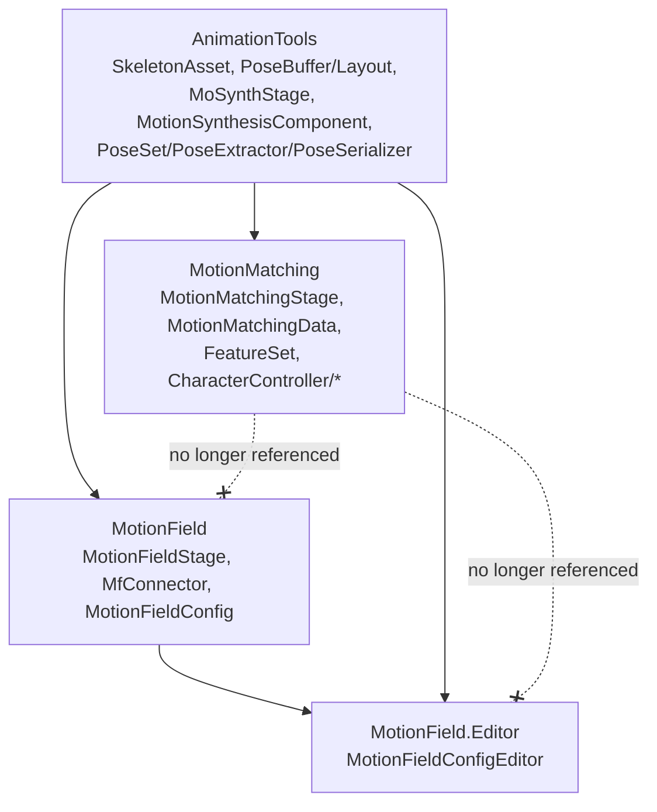

# Requirements

### Overview & Goals
The `MotionField` runtime and editor assemblies currently reference `MotionMatching` even though the code they actually use from it is generic pipeline infrastructure (stage base class, orchestrator, pose extraction/serialization), not anything specific to the motion-matching search algorithm. The goal is to make `MotionField` (and `MotionField.Editor`) build without any reference to `MotionMatching`, by relocating the generic, reusable pieces into the existing `AnimationTools` assembly — continuing the precedent already set by `IPoseSetSource`.

### Scope
**In Scope**
- Move `MoSynthStage`, `MotionSynthesisComponent`, `PoseSet`, `PoseExtractor`, `PoseSerializer`, `MmPoseLayoutBuilder` (renamed), `SkeletonMap`, `SkeletonAssetExtensions`, `Tags.cs` (`QueryTag`), `BinarySerializerExtensions`, `MathExtensions` from the `MotionMatching` assembly into `AnimationTools`, under the `AnimationTools` namespace.
- Extract the `JointToMecanim` struct out of `MotionMatchingData` into a shared `AnimationTools` type so `MotionFieldConfig` no longer needs `MotionMatchingData.JointToMecanim`.
- Align the three files that already physically live in `AnimationTools` but still declare `namespace MotionMatching` (`AnnotatedAnimationClip`, `BvhAnimation`, `IPoseSetSource`) to `namespace AnimationTools`, fixing the stale inconsistency and the outdated doc comment on `IPoseSetSource`.
- Remove `MotionSynthesisComponent.MmData` (which required knowing about `MotionMatchingStage`/`MotionMatchingData`) and replace it with an extension method living inside the `MotionMatching` assembly, updating all its call sites (all of which are already inside `MotionMatching`).
- Update `MotionField.asmdef` to drop the `MotionMatching` reference.
- Fully decouple `MotionField.Editor` too: rework the "Import Settings From MotionMatchingData" convenience in `MotionFieldConfigEditor.cs` to work generically over any `IPoseSetSource`-implementing asset, and drop `MotionMatching` from `MotionField.Editor.asmdef`.
- Update every affected `using` directive across both assemblies and fix compile errors introduced by the moves.

**Out of Scope**
- `RetargetingStage`'s own separate `MotionMatchingData` coupling (already flagged by its own `// TODO: Retargeting should be independent of Motion Matching` comment) — unrelated to MotionField, left as is.
- Moving `PoseBufferFK` (only used by `RetargetingStage`/`FeatureSet`, both motion-matching-search-specific) or `FeatureSet`/`FeatureExtractor`/`MotionMatchingSearch` — these are genuinely search-specific and correctly remain in `MotionMatching`.
- Any behavioral/gameplay changes to motion field synthesis, Python interop, or motion matching search.
- Renaming the `MotionMatching` namespace used by types that legitimately stay in the `MotionMatching` assembly (e.g. `MotionMatchingStage`, `MotionMatchingData`, `FeatureSet`).

### Functional Requirements
- `MotionField.asmdef` and `MotionField.Editor.asmdef` must not list `MotionMatching` in `references` after the change.
- All existing MotionField behavior (stage execution, pose database extraction/serialization, bone-weight editor, debug visualizer) must keep working identically.
- All existing MotionMatching behavior (search, character controllers, retargeting, editor tools) must keep compiling and working identically after the relocated types move to `AnimationTools`.
- Existing serialized assets (`MotionFieldConfig` assets with `animationChannelToMecanim` data, scenes with `MotionSynthesisComponent`/stage lists) must not lose data — files must be moved (not recreated) to preserve `.meta` GUIDs, and the `JointToMecanim` struct move must preserve the plain-serializable field layout.
- The Editor's "Import Settings From MotionMatchingData" feature becomes "Import Settings From an IPoseSetSource asset", working with both `MotionMatchingData` and any future `IPoseSetSource` implementer, not just `MotionMatchingData`.

# Technical Design

### Current Implementation
- `MotionField.asmdef` / `MotionField.Editor.asmdef` reference `MotionMatching` because `MotionFieldStage`/`MfConnector` inherit `MoSynthStage` and use `MotionSynthesisComponent` (`Assets/MotionMatching/Runtime/Core/MoSynthStage.cs`, `MotionSynthesisComponent.cs`), and `MotionFieldConfig`/`MotionFieldConfigEditor` use `PoseSet`, `PoseExtractor`, `PoseSerializer` (`Assets/MotionMatching/Runtime/Pose/*.cs`) plus `MotionMatchingData.JointToMecanim` directly.
- Investigation shows none of these classes actually depend on motion-matching-search concepts (`FeatureSet`, `MotionMatchingData`, `MotionMatchingSearch`) — they only use `AnimationTools` primitives (`PoseBuffer`, `PoseLayout`, `SkeletonAsset`, `PoseSequence`) plus each other. The only real coupling point is `MotionSynthesisComponent.MmData`, which does `stage is MotionMatchingStage mm` to fish out a `MotionMatchingData`.
- `IPoseSetSource`, `AnnotatedAnimationClip` and `BvhAnimation` already physically live in `Assets/AnimationTools/Runtime/` from earlier work, but still declare `namespace MotionMatching` — a leftover inconsistency (`IPoseSetSource`'s own doc comment is stale, claiming it "lives in the MotionMatching runtime assembly").
- `MotionMatchingData.JointToMecanim` is a plain `[Serializable]` struct nested in `MotionMatchingData`; `MotionFieldConfig.animationChannelToMecanim` is typed directly against it.

### Key Decisions
- **Extend `AnimationTools` rather than introduce a new assembly.** Confirmed with the user: both `MotionMatching` and `MotionField` already reference `AnimationTools`, so this is zero new asmdef surface, and it follows the exact precedent already set by `IPoseSetSource`.
- **Use the `AnimationTools` namespace (not `MoSynth` or kept `MotionMatching`) for everything that moves**, per user direction ("general MotionSynthesis stuff can be moved to a global like Animation Tools"), matching the namespace already used by `PoseBuffer`/`PoseLayout`/`SkeletonAsset`. The three already-misplaced files (`AnnotatedAnimationClip`, `BvhAnimation`, `IPoseSetSource`) are fixed to match at the same time, since plain-serializable/asset types are unaffected by a namespace change (Unity resolves `MonoBehaviour`/`ScriptableObject` instances by script GUID, and plain `[Serializable]` field types by structural layout, not by fully-qualified name).
- **Resolve `MotionSynthesisComponent.MmData` via an extension method kept inside `MotionMatching`.** Since `MotionMatchingStage`/`MotionMatchingData` correctly stay in `MotionMatching`, the property is removed from `MotionSynthesisComponent` and replaced by `public static MotionMatchingData GetMmData(this MotionSynthesisComponent msc)` in a new `MotionSynthesisComponentExtensions` class inside `MotionMatching`. All 7 call sites (`CollisionsSpringControlInput.cs`, `CrowdControlInput.cs`, `CrowdSplineControlInput.cs`, `PathControlInput.cs`, `SplineControlInput.cs`, `SpringControlInput.cs`, `MotionMatchingControlInput.cs`) are already inside `MotionMatching`, so this is a same-assembly, low-risk change that incidentally starts resolving the pre-existing `MotionSynthesisComponent` → `MotionMatchingData` TODO.
- **Generalize the "Import Settings" editor feature via `IPoseSetSource` instead of dropping it.** Per the user's choice to fully decouple `MotionField.Editor`, the button is reworked to accept any `IPoseSetSource`-implementing asset (found by a generic `ObjectField`/type check) instead of a hard-typed `MotionMatchingData` field. `IPoseSetSource` gains one new member (`IReadOnlyList<JointToMecanim> AnimationChannelToMecanim`) so the mecanim-map copy keeps working without a `MotionMatchingData`-specific cast — both `MotionMatchingData` and `MotionFieldConfig` already hold exactly this data shape, so implementing it is trivial on both sides.
- **Extract `JointToMecanim` into `AnimationTools`** as a standalone `[Serializable]` struct, referenced by both `MotionMatchingData.animationChannelToMecanim` and `MotionFieldConfig.animationChannelToMecanim`, removing the last direct `MotionFieldConfig → MotionMatchingData` type reference.

### Proposed Changes
**Move into `AnimationTools` (namespace `AnimationTools`), physically relocating files to preserve `.meta` GUIDs:**
- `Assets/MotionMatching/Runtime/Core/MoSynthStage.cs` → `Assets/AnimationTools/Runtime/Core/MoSynthStage.cs`
- `Assets/MotionMatching/Runtime/Core/MotionSynthesisComponent.cs` → `Assets/AnimationTools/Runtime/Core/MotionSynthesisComponent.cs` (with `MmData` property removed)
- `Assets/MotionMatching/Runtime/Pose/PoseSet.cs`, `PoseExtractor.cs`, `PoseSerializer.cs` → `Assets/AnimationTools/Runtime/Pose/`
- `Assets/MotionMatching/Runtime/Pose/MmPoseLayoutBuilder.cs` → `Assets/AnimationTools/Runtime/Pose/PoseLayoutBuilder.cs` (renamed, dropping the now-misleading "Mm" prefix)
- `Assets/MotionMatching/Runtime/Pose/SkeletonMap.cs`, `SkeletonAssetExtensions.cs` → `Assets/AnimationTools/Runtime/Skeleton/`
- `Assets/MotionMatching/Runtime/Core/Tags.cs` (`QueryTag`, operates over `PoseSet.AnimationTag`) → `Assets/AnimationTools/Runtime/Pose/Tags.cs`
- `Assets/MotionMatching/Runtime/Utils/BinarySerializerExtensions.cs`, `MathExtensions.cs` → `Assets/AnimationTools/Runtime/Utils/`
- New `Assets/AnimationTools/Runtime/Skeleton/JointToMecanim.cs` extracted out of `MotionMatchingData`

**Namespace-only fix (no physical move):**
- `AnnotatedAnimationClip.cs`, `BvhAnimation.cs`, `IPoseSetSource.cs` (already in `AnimationTools`): `namespace MotionMatching` → `namespace AnimationTools`; refresh `IPoseSetSource`'s stale doc comment.

**Stay in `MotionMatching` (unchanged namespace/location):**
- `MotionMatchingStage.cs`, `MotionMatchingData.cs` (minus the extracted struct), `FeatureSet.cs`/`FeatureExtractor`/`FeatureSerializer`, `MotionMatchingSearch/*`, `RetargetingStage.cs`, `RootMotionCorrectionStage.cs`, `ContactVisualizerStage.cs`, `PoseSetVisualizerStage.cs`, `PoseBufferFK.cs`, `CharacterController/*`, `Inertialization.cs`, `Spring.cs`.
- New `Assets/MotionMatching/Runtime/Core/MotionSynthesisComponentExtensions.cs` with `GetMmData(this MotionSynthesisComponent)`.

**`MotionField` runtime (`Assets/MotionField/*.cs`):**
- `MotionFieldStage.cs`, `MfConnector.cs`, `MotionFieldConfig.cs`, `MotionFieldVisualizer.cs`: replace `using MotionMatching;` with `using AnimationTools;` where the only remaining need is `MoSynthStage`/`MotionSynthesisComponent`/`PoseSet`/`AnnotatedAnimationClip`/`IPoseSetSource`.
- `MotionFieldConfig.cs`: `animationChannelToMecanim` field type changes from `List<MotionMatchingData.JointToMecanim>` to `List<AnimationTools.JointToMecanim>`.
- `MotionField.asmdef`: remove `"MotionMatching"` from `references`.

**`MotionField.Editor` (`Assets/MotionField/Editor/MotionFieldConfigEditor.cs`):**
- `_importSource` changes from `MotionMatchingData` to a generic `ScriptableObject`/`UnityEngine.Object` field validated against `IPoseSetSource`.
- Copies `HipsForwardLocalVector`, `ContactVelocityThreshold`, and the new `AnimationChannelToMecanim` purely through the `IPoseSetSource` interface.
- `MotionField.Editor.asmdef`: remove `"MotionMatching"` from `references`.

### Data Models / Contracts
```csharp
// Assets/AnimationTools/Runtime/Skeleton/JointToMecanim.cs
namespace AnimationTools
{
    [Serializable]
    public struct JointToMecanim
    {
        public string name;
        public HumanBodyBones mecanimBone;
        public JointToMecanim(string name, HumanBodyBones mecanimBone) { ... }
    }
}

// Assets/AnimationTools/Runtime/IPoseSetSource.cs (extended)
public interface IPoseSetSource
{
    string name { get; }
    float3 HipsForwardLocalVector { get; }
    float ContactVelocityThreshold { get; }
    IReadOnlyList<JointToMecanim> AnimationChannelToMecanim { get; } // new
    bool TryGetMecanimBone(string jointName, out HumanBodyBones bone);
    string GetAssetPath();
}

// Assets/MotionMatching/Runtime/Core/MotionSynthesisComponentExtensions.cs
namespace MotionMatching
{
    public static class MotionSynthesisComponentExtensions
    {
        public static MotionMatchingData GetMmData(this MotionSynthesisComponent msc)
        {
            foreach (var stage in msc.stages)
                if (stage is MotionMatchingStage mm) return mm.mmData;
            return null;
        }
    }
}
```

### Architecture Diagram


### Risks
- **Scene/prefab GUID preservation**: `MotionSynthesisComponent` is a `MonoBehaviour` placed directly in scenes (e.g. `ExampleSimpleMMStages.unity`). It must be physically moved (not deleted and recreated) so its script `.meta` GUID is preserved and existing component references stay valid.
- **`[SerializeReference]` stage list**: `MotionSynthesisComponent.stages` is `[SerializeReference] List<MoSynthStage>`. Moving the abstract `MoSynthStage` base class assembly does not affect already-serialized concrete stage types (`MotionMatchingStage`, `MotionFieldStage`, etc.), since Unity records the concrete runtime type per element, not the base type — verified none of those concrete types are moving.
- **`JointToMecanim` struct move**: plain `[Serializable]` structs are serialized structurally, not by type name, so relocating/renaming the containing type does not lose existing `MotionFieldConfig`/`MotionMatchingData` asset data; still worth a spot-check on an existing asset after the move.
- **NUnit dependency in `PoseSerializer.cs`** (`Assert.IsTrue` from `NUnit.Framework`) moving into a non-test assembly (`AnimationTools`) needs the same implicit resolution it currently has in `MotionMatching`; verify this still compiles once relocated, and drop the `NUnit.Framework` usage if compilation fails without a Test Assembly context.

# Testing

### Validation Approach
After each stage, trigger a Unity asset database refresh/recompile and inspect the Editor log / `ValidateScript` output for `error CS` entries across all touched assemblies, mirroring the verification approach used in the prior MotionField-assembly-extraction session.

### Key Scenarios
- `MotionField.asmdef` and `MotionField.Editor.asmdef` compile with `MotionMatching` absent from `references`, and their generated `.csproj` files no longer list a `MotionMatching` project reference.
- `AnimationTools`, `AnimationTools.Editor`, `MotionMatching`, `MotionMatching.Editor`, `MotionMatching.Tests` all recompile without errors after the moves and `using` updates.
- `MotionMatchingData` and `MotionFieldConfig` both still expose `animationChannelToMecanim`/`AnimationChannelToMecanim` correctly typed against the new shared `AnimationTools.JointToMecanim`.
- The reworked "Import Settings" button in `MotionFieldConfigEditor` successfully copies `HipsForwardLocalVector`, `ContactVelocityThreshold`, and the mecanim map from an existing `MotionMatchingData` asset (now going through `IPoseSetSource`, not a direct type reference).
- `MotionSynthesisComponent.GetMmData()` (new extension method) returns the same value the old `MmData` property did for a stage list containing a `MotionMatchingStage`.

### Edge Cases
- A `MotionSynthesisComponent` whose `stages` list has no `MotionMatchingStage` (motion-field-only stack): `GetMmData()` must still return `null` without throwing, matching current behavior.
- Existing `MotionFieldConfig` assets with previously-authored `animationChannelToMecanim` entries must retain their data after the struct relocation (spot-check by opening an existing asset in the Inspector).
- `PoseSet`/`PoseSerializer` round-trip tests in `Assets/MotionMatching/Tests/Editor/PoseSerializerRoundTripTests.cs` and `PoseSetStorageTests.cs` must keep passing after `PoseSet`/`PoseSerializer` move to `AnimationTools` (namespace-only `using` updates expected, no asmdef change since `MotionMatching.Tests` already references `AnimationTools`).

# Delivery Steps

### ✓ Step 1: Move generic utilities and align existing namespace inconsistencies
AnimationTools gains the low-level generic helpers the pose pipeline depends on, and its already-misplaced files are consistent with it.

- Move `MathExtensions.cs` and `BinarySerializerExtensions.cs` from `Assets/MotionMatching/Runtime/Utils/` to `Assets/AnimationTools/Runtime/Utils/`, changing their namespace to `AnimationTools`.
- Move `SkeletonAssetExtensions.cs` and `SkeletonMap.cs` from `Assets/MotionMatching/Runtime/Pose/` to `Assets/AnimationTools/Runtime/Skeleton/`, changing their namespace to `AnimationTools`.
- Change `namespace MotionMatching` to `namespace AnimationTools` in `AnnotatedAnimationClip.cs`, `BvhAnimation.cs`, and `IPoseSetSource.cs` (already physically in `Assets/AnimationTools/Runtime/`), and refresh `IPoseSetSource`'s stale doc comment about where it lives.
- Add `using AnimationTools;` (and drop now-unneeded `using MotionMatching;`) in every consumer of the moved types within the `MotionMatching` assembly (e.g. `Inertialization.cs`, `Spring.cs`, `CharacterController/*`, `RetargetingStage.cs`).
- Recompile and confirm no `error CS` remain in `AnimationTools`, `AnimationTools.Editor`, `MotionMatching`, `MotionMatching.Editor`.

### ✓ Step 2: Move the pose extraction/serialization pipeline into AnimationTools
PoseSet, pose extraction, and pose serialization live in AnimationTools under a generalized, non-motion-matching-specific name.

- Move `PoseSet.cs`, `PoseExtractor.cs`, `PoseSerializer.cs` from `Assets/MotionMatching/Runtime/Pose/` to `Assets/AnimationTools/Runtime/Pose/`, namespace `AnimationTools`.
- Move and rename `MmPoseLayoutBuilder.cs` to `Assets/AnimationTools/Runtime/Pose/PoseLayoutBuilder.cs`, dropping the `Mm`-specific naming, namespace `AnimationTools`.
- Move `Tags.cs` (`QueryTag`, which operates over `PoseSet.AnimationTag`) to `Assets/AnimationTools/Runtime/Pose/Tags.cs`, namespace `AnimationTools`.
- Extract `JointToMecanim` out of `MotionMatchingData.cs` into a new `Assets/AnimationTools/Runtime/Skeleton/JointToMecanim.cs`, and update `MotionMatchingData.animationChannelToMecanim` to use it.
- Update `MotionMatchingData.cs` and any other `MotionMatching`-assembly consumer (e.g. `MotionMatchingDataEditor.cs`, `SkeletonAssetFromMmData.cs`) to reference the relocated `PoseSet`/`PoseExtractor`/`PoseSerializer`/`PoseLayoutBuilder`/`JointToMecanim`/`QueryTag` via `AnimationTools`.
- Recompile and confirm `MotionMatching`, `MotionMatching.Editor`, and `MotionMatching.Tests` still build clean, and existing pose serializer round-trip tests still pass.

### ✓ Step 3: Move MoSynthStage and MotionSynthesisComponent, decoupling MmData
The stage pipeline base class and orchestrator live in AnimationTools with no reference back to MotionMatching-specific types.

- Move `MoSynthStage.cs` and `MotionSynthesisComponent.cs` from `Assets/MotionMatching/Runtime/Core/` to `Assets/AnimationTools/Runtime/Core/`, physically moving the files to preserve `.meta` GUIDs (they're referenced by scenes), namespace `AnimationTools`.
- Remove the `MotionSynthesisComponent.MmData` property (its `stage is MotionMatchingStage mm` check can't compile outside `MotionMatching`).
- Add `Assets/MotionMatching/Runtime/Core/MotionSynthesisComponentExtensions.cs` with a `GetMmData(this MotionSynthesisComponent msc)` extension method reproducing the removed property's logic, namespace `MotionMatching`.
- Update the 7 call sites of `.MmData` (`CollisionsSpringControlInput.cs`, `CrowdControlInput.cs`, `CrowdSplineControlInput.cs`, `PathControlInput.cs`, `SplineControlInput.cs`, `SpringControlInput.cs`, `MotionMatchingControlInput.cs`) to call `.GetMmData()` instead.
- Update `using` directives in the remaining `MoSynthStage` subclasses that stay in `MotionMatching` (`MotionMatchingStage.cs`, `RetargetingStage.cs`, `RootMotionCorrectionStage.cs`, `ContactVisualizerStage.cs`, `PoseSetVisualizerStage.cs`) to reference `MoSynthStage`/`MotionSynthesisComponent` via `AnimationTools`.
- Recompile and confirm the whole `MotionMatching` stack (runtime, editor, tests) and the demo scene's `MotionSynthesisComponent` references remain intact.

### ✓ Step 4: Drop MotionMatching from the MotionField runtime assembly
MotionField.asmdef no longer references MotionMatching and the runtime scripts compile against AnimationTools directly.

- Update `MotionFieldStage.cs`, `MfConnector.cs`, `MotionFieldVisualizer.cs` to replace `using MotionMatching;` with `using AnimationTools;` for `MoSynthStage`/`MotionSynthesisComponent`/`PoseBuffer`.
- Update `MotionFieldConfig.cs`: replace `using MotionMatching;` with `using AnimationTools;`, and change `animationChannelToMecanim` from `List<MotionMatchingData.JointToMecanim>` to `List<AnimationTools.JointToMecanim>`.
- Remove `"MotionMatching"` from `Assets/MotionField/MotionField.asmdef`'s `references`.
- Recompile and confirm `MotionField.csproj` no longer references the `MotionMatching` project, and all runtime MotionField scripts (`MotionFieldStage`, `MfConnector`, `MotionFieldConfig`, `MotionFieldVisualizer`, `MotionFieldBoneWeights`, `PythonRuntime`) compile clean.

### ✓ Step 5: Decouple MotionField.Editor and generalize the settings-import feature
MotionField.Editor.asmdef no longer references MotionMatching; the settings-import button works over any IPoseSetSource asset.

- Extend `IPoseSetSource` with `IReadOnlyList<JointToMecanim> AnimationChannelToMecanim { get; }`, and implement it on both `MotionMatchingData` and `MotionFieldConfig`.
- Rework `MotionFieldConfigEditor.cs`'s "Import Settings" section: change `_importSource` from `MotionMatchingData` to a generic asset field validated/cast against `IPoseSetSource`, and copy `HipsForwardLocalVector`, `ContactVelocityThreshold`, and `AnimationChannelToMecanim` purely through the interface.
- Remove `"MotionMatching"` from `Assets/MotionField/Editor/MotionField.Editor.asmdef`'s `references`.
- Trigger a full asset database refresh/recompile and verify via the Editor log / `ValidateScript` that no `error CS` remain anywhere in the project, and that both `MotionField.asmdef` and `MotionField.Editor.asmdef` have no `MotionMatching` reference in their generated `.csproj` files.