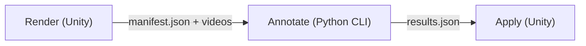

# Auto-tagging clips with a video model

Hand-authoring [tag channels](clip-tags.md) across a whole library is slow. Auto-tagging lets a
video model do the first pass: you pick tags, write what each one means in plain language, and
Gemini watches every clip and reports the frames where each tag applies. Treat the result as a
draft to check in the clip editor, not as ground truth.

## The three stages

All three read and write one run folder under `Library/AutoTag/<timestamp>/`, so any stage can be
re-run on its own. Library keeps the videos out of version control. The window at
`MoSynth/Animation/Auto Tag...` drives all of them, with a **Run All** that chains them.

1. **Render.** Each clip's `[startFrame, endFrame)` slice becomes a short MP4. The manifest records
   the clips, the tags with their descriptions, and each clip's ground speed per second, which is
   sent along as supporting evidence.
2. **Annotate.** Unity starts the project venv's Python as a child process. For each clip it uploads
   the video and asks for every tag's frame ranges, returned as JSON with a fixed schema. By default
   all tags share one request; *One Request Per Tag* asks about each tag separately so tags cannot
   sway each other, at the price of paying for the video once per tag. Either way the model is told
   tags are independent and may overlap. It is a separate process, not PythonNET, so minutes of
   network waiting never block the editor.
3. **Apply.** The ranges become channel keys, written the same way *Detect Footfalls* writes:
   one undo step for the whole batch.

## What the model sees

The figure is a capsule stick figure, **not** the character mesh. Left limbs are blue, right limbs
are red, and there is a small nose on the head. It works the same for every rig, including BVH rigs
with no mesh, and the colours make left and right unambiguous. The camera follows the character
over a checker floor but keeps the heading it had on the first frame, so a turn shows as the figure
rotating and travel shows as the floor sliding past.

Every video frame carries its **clip frame number** burned into the top-left corner. The model is
told to read frame numbers off that counter rather than work them out from video time. That is what
makes its answer line up with the clip's own frames whatever rate the video was sampled at.

## Descriptions are the whole interface

A tag's meaning comes from the **Description** field on the tag asset (edit it in the Inspector or
inline in the window; the Tags Browser shows it on hover). The descriptions of the tag's parents
are sent as context too, so `animation.action` can say "what the character's body is doing" once
for all its children. A tag with no description blocks the run. Better descriptions are the
cheapest way to better results: name the boundary cases, such as when a walk becomes a run.

## Trusting the output

- **Timing is approximate.** At the default 10 video fps a 30 fps clip is sampled every 3 frames,
  and the model adds its own error on top. Expect to nudge boundaries.
- **Existing work is protected.** A channel that already has keys for a tag is skipped unless you
  choose *Overwrite* when applying. Nothing records that a channel was hand-corrected, so that
  prompt is the only guard.
- **Noise is filtered before it reaches the clip.** Low-confidence ranges are dropped, ranges
  separated by a tiny gap are merged, and ranges too short to mean anything are removed. The
  thresholds are in the window's settings.
- **Long takes are sent whole.** If accuracy drops on multi-minute clips, the fix is to split them
  into overlapping chunks at render time. That is not built yet.

## Cost, keys and data

The API key is read from the `GEMINI_API_KEY` environment variable and never stored in the
project. Use a key on a billed project: on Gemini's free tier, Google may use inputs to improve its
products, which matters for capture data with licence restrictions. The window shows a cost
estimate before running. At low media resolution a video frame costs about 70 input tokens, so an
hour of motion at 10 fps is roughly 2.5M tokens.

Each clip's raw answer is saved before it is parsed. Re-running annotate with `--resume` re-reads
those answers instead of paying for the calls again.

Operational detail — the run-folder contract, stdout protocol and hazards — is in
[`agents/animation-tools/auto-tagging.md`](../agents/animation-tools/auto-tagging.md).
