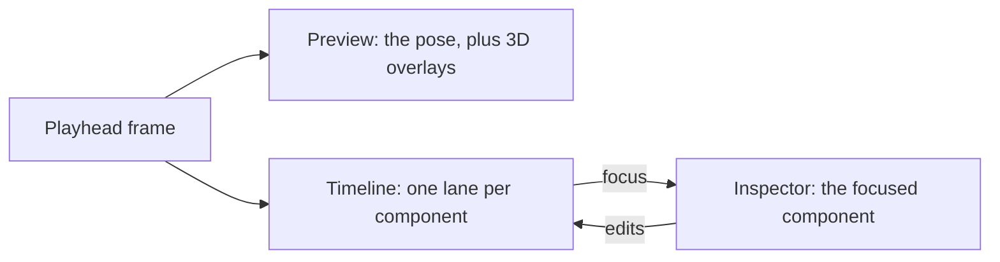

# The annotated clip editor

An `AnnotatedAnimationClip` carries more than an animation. It carries a slice of that animation
(`startFrame` to `endFrame`) and a list of `AnimationClipComponent`s — annotation the clip's own
curves cannot supply, such as where each foot lands. The clip editor is where you look at that
annotation against the motion it describes, and correct it.

Open it from `MoSynth/Animation/Clip Editor...`, by double-clicking an annotated clip, or from the
**Open in Clip Editor** button on the clip's Inspector.

## What it is for

The Inspector can show you a component's fields. It cannot answer the question you actually have,
which is *"is this annotation right?"* — because answering that means comparing an annotation
against the pose at the frame it claims something about. So the window puts three things side by
side and keeps them on the same frame:

The timeline is zoomable (wheel), pannable (middle-drag or alt-drag) and scrubbable, and `F` frames
the slice while `A` frames the whole clip. It stays responsive on clips of several thousand frames —
see [Why the bands are textures](#why-the-bands-are-textures-and-the-anchors-are-not).

## The two frame spaces

This is the one thing worth knowing before reading any of the code. There are two ways to number a
frame, they differ by `startFrame`, and confusing them is the easiest mistake to make here.

- A **clip frame** indexes the whole baked animation. The preview poses clip frames, and the
  timeline's axis runs over clip frames.
- A **slice frame** is relative to `startFrame`. `GaitPhase.Footfall.frame` is a slice frame, so
  that an anchor keeps meaning the same moment of motion when the slice is moved.

`ClipEditorContext` owns the conversion — `SliceToClipFrame` and `ClipToSliceFrame` — and exposes
the two counts under names that say which is which (`ClipFrameCount`, `SliceFrameCount`). Nothing
downstream reads `FrameCount` directly, because `AnnotatedAnimationClip` shadows that member with a
slice-local version and the shadowing is invisible at the call site: which one you get depends on
the *static* type of the expression, not the object. `SkeletonPreview.Source` is typed as the base
`SkeletonAnimation` for exactly this reason.

**The axis runs over whole-clip frames, not the slice.** The alternative was tempting — most lanes
hold slice-local data — but the slice's own handles live on this ruler, and on a slice-local axis
dragging the start handle would slide every lane sideways under the cursor while you dragged it.
Trimming is also one of the main jobs here, and you cannot trim what you cannot see, so the material
outside the slice stays on screen and is dimmed rather than hidden.

## Tracks: components decide how they are drawn

A component type is added by declaring a `[Serializable]` subclass, with no registration step. The
editor keeps that property: a component's *view* is an `AnimationClipComponentTrack` tagged with
`[ClipComponentTrack(typeof(TheComponent))]`, and the window finds it through `TypeCache`.

A track can fill three surfaces, and may fill any subset:

| Surface | Method | What it is for |
|---|---|---|
| Timeline lane | `DrawTrack` | The component's data along time, and any direct manipulation of it |
| Inspector | `DrawInspector` | Settings, actions, and the summary that says whether the data is good |
| Preview overlay | `DrawPreviewOverlay` | 3D geometry drawn into the preview — a trajectory, a marker |

**Writing a track is an upgrade, never a prerequisite.** A component with no registered track gets a
`DefaultComponentTrack`: a lane showing its own `Describe()` line, and an inspector that is a single
`PropertyField` over the managed reference. Because that property is the `[SerializeReference]` list
element, the SubclassSelector drawer expands it into every field the component declares — so a
component type added tomorrow is fully authorable in this window with no editor code at all.

The gutter down the left of the timeline is the clip's component list, and it behaves like the
Inspector's: drag its right edge to widen it, and **Add Component** sits under the last entry. The
**Lanes** menu in the toolbar chooses which components are drawn, and the eye toggle in each lane
header writes the same flag. Lane visibility, lane height and the gutter's width are view state kept
outside the asset — which lanes you happen to be looking at is not part of the animation's data.

Clicking a lane focuses its row, which is both what fills the inspector on the right and what hands
that lane the keyboard.

`GaitPhaseTrack` and `AnimationTagTrack` are the worked examples, and they share one Blender-style
keymap: click and shift-click to select, drag from empty space or `B` to box select, `G` to move,
`X` to delete, and a typed number for an exact offset. A mode previews and writes nothing until you
confirm it, so `Escape` costs neither an undo entry nor a re-bake of the clip.

## Gait phase in the window

The lane shows three things stacked: the phase as a filled band, each foot's contact as a bar, and
the footfall anchors as draggable marks. The inspector holds the detection settings, the **Detect
Footfalls** button, and the summary — counts, mean stride, the percentage of frames with no
measurable cycle, and the two warnings that tell you the detection went wrong. That summary is the
highest-value part of the UI: it is what says whether a clip's phase is usable.

Anchors can be clicked to select and seek, shift-clicked to toggle, rubber-band selected, dragged
(singly or as a group), added by double-clicking empty space, and deleted. Right-click offers the
same plus setting an anchor's foot. Dragging is clamped to the slice, and the list is re-sorted on
commit — both for reasons that would otherwise lose data silently, described below.

The preview overlay marks each resolved contact bone and traces where it travels over the next 20
frames, which is how you tell a real footfall from one the detector invented: a planted foot's trace
is a point, a moving foot's is a line.

**The contact bands are empty until you run detection.** Contact flags are not stored on the clip —
only the footfalls derived from them are — so they exist for the session and no longer. Persisting
them would be a change to the data model, and is not one this window made.

## Decisions worth knowing

### Why the shell is UI Toolkit and the surfaces are IMGUI

The window frame — toolbar, splitters, resizable panes — is UI Toolkit, which is straightforwardly
better at layout than IMGUI. The preview, timeline and inspector inside it are each an
`IMGUIContainer`.

The preview had no real choice: `PreviewRenderUtility.BeginPreview`/`EndPreview` resolves its rect
through `GUIClip` and hands back a texture you are expected to blit with `GUI.DrawTexture`. It is an
IMGUI API in all but name, and driving it from outside a live IMGUI repaint gives a mis-sized or
blank render.

The timeline could have gone either way, and the deciding argument was not performance. Performance
is close to a wash: a dense signal has to be a cached texture in either stack, and sparse elements
have to be culled to the visible frame range in either stack, and what remains is a few hundred
draws per repaint. What decided it is that `DrawTrack` is a public seam other people extend. Writing
one in IMGUI means `GUI`, `Handles` and `Event.current` — which is what every other editor in this
project already speaks. The UI Toolkit equivalent would ask a track author to allocate
`VisualElement`s, write a `PointerManipulator` for each drag, and emit vertices into a
`MeshGenerationContext`. A seam that costs that much to use is a seam nobody uses.

### Why the bands are textures and the anchors are not

A per-frame vector draw costs one primitive per frame on every repaint, which makes the timeline's
cost scale with clip length — the wrong shape entirely. `TimelineSignalTexture` rasterises a dense
signal once at one pixel column per frame and then draws it as a single blit under a moving UV
window, so zooming and panning change only the UVs and the cost is constant. The rebuild is the
expensive part and happens only when `ClipEditorContext.DataVersion` moves.

Anchors are drawn as vectors anyway, because they are the interactive elements. They need a
pixel-accurate hit rect at any zoom, and they have to follow a drag without the texture being
rebuilt underneath them.

### Why an edit commits once, at the end of an interaction

Every persistent edit goes through `SerializedObject`/`SerializedProperty`, which is what makes it
undoable. But `ApplyModifiedProperties` fires the asset's `OnValidate`, which clears its cached pose
sequence, and the next preview repaint therefore re-runs `AnimationClipBaker.Bake` over the whole
clip. Committing on every mouse-move during a drag would re-bake thousands of frames sixty times a
second.

So a drag keeps a transient offset and renders anchors at `frame + delta`, and commits once on
mouse-up: one undo entry, one re-bake. Scrubbing the ruler writes nothing at all.

The narrower fix — invalidating the bake only when something the bake depends on actually changes —
would remove the cost rather than route around it, but it is a change to runtime code and has not
been made.

### Two silent data losses the editing code exists to prevent

Both of these delete anchors without reporting anything, which is why they are handled in a tested
pure helper (`FootfallEdits`) rather than inline:

1. `GaitPhaseComponent.OnValidate` removes any anchor outside the slice. So an anchor drag is
   clamped to the slice before it is committed, and dragging the end-frame handle is a way to delete
   anchors — undoably, but without a prompt.
2. `GaitPhase` drops any anchor that is not strictly later than the one before it. So the list is
   re-sorted on every commit; dragging one anchor past another reorders rather than colliding.

## What this replaced

`GaitPhaseStrip` — a fixed-width texture strip in the clip's Inspector with click-to-seek but no
zoom, no panning, and no per-anchor hit-testing — is gone. Its phase and contact pixel rules moved
to `GaitPhaseSignalBuilder`, its summary and warnings to `GaitPhaseTrack`'s inspector, and its
footfall ticks became the draggable anchors. The clip's Inspector keeps the asset's fields,
validation and frame readout, and hands off to this window for everything else.

## See also

- [Animation sources and clip baking](animation-sources.md) — where the baked poses this window
  previews come from, and what gait phase means.
- [Skeletons and rig binding](skeletons-and-rig-binding.md) — why the preview needs an asset rig.
- [Authoring a clip editor track](../agents/animation-tools/clip-editor-tracks.md) — the exact
  contract, hazards and verification steps.
