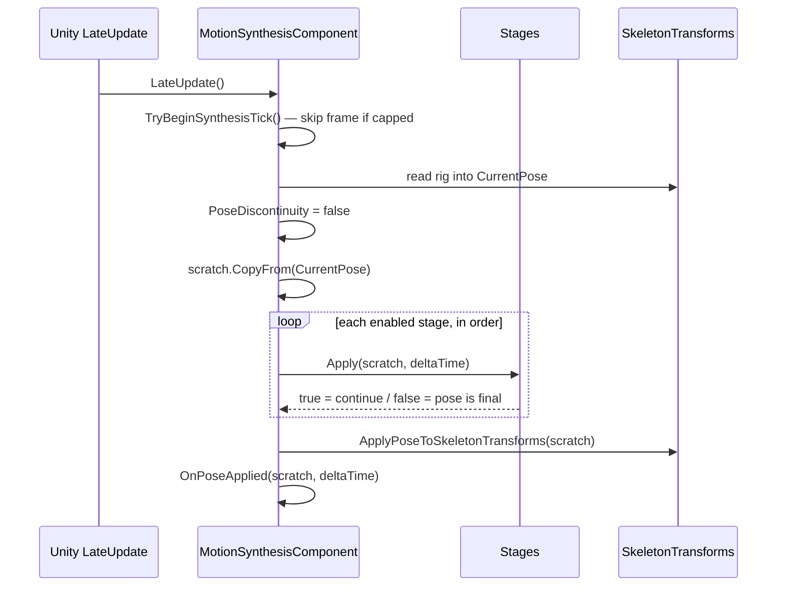

# The synthesis pipeline

Every animated character in MoSynth is driven by one `MotionSynthesisComponent`. It owns the
skeleton, the pose layout, the buffers, the binding to the scene rig, the frame loop, and the
write-back to Unity Transforms. It owns no synthesis at all. That belongs to a list of
`MoSynthStage`s, and a stage's entire job is to rewrite the pose in place.

This split is the most important structural fact about the codebase. Motion matching and the neural
motion field are not alternative architectures — they are two stages that plug into the same seam,
and a character can run either, both, or neither.

## The stage contract

A stage gets four callbacks and nothing else:

```csharp
public abstract void Init(MotionSynthesisComponent motionSynthesisComponent);
public virtual  void OnValidate() { }
public abstract bool Apply(PoseBuffer pose, float deltaTime);
public virtual  void OnDestroy() { }
```

A stage is a plain `[Serializable]` class, **not** a MonoBehaviour. That is deliberate: a
MonoBehaviour would bring Unity's own lifecycle with it — its own `Awake`, its own `enabled`, its own
execution order — and would be in a position to supply or mutate the skeleton. Keeping stages as
plain objects in a `[SerializeReference]` list means the four callbacks above are the whole contract,
and they run in the list's declaration order rather than under Unity's component ordering. The
skeleton is settled before any of them run, so a stage reads it rather than providing it.

One consequence follows directly: `OnDestroy` is the only place a stage can release native
collections. Nothing else will.

### Returning false does not cancel the tick

`Apply` returns a bool, and it is easy to read it as "did this succeed". It is not.

**`true` means continue the pipeline. `false` means *this pose is final*.** The component still
applies the result either way. Returning `false` short-circuits the remaining stages; it does not
discard the frame, and it does not leave the character unposed.

### Disabling a stage skips only Apply

Setting `isEnabled = false` skips `Apply`. `Init`, `OnValidate` and `OnDestroy` still run.

This looks like an inconsistency and is in fact the point. If `Init` were conditional on the toggle,
then whether a stage contributed to the pose layout would depend on a runtime flag — so flipping a
stage on or off mid-run could reshape the buffer underneath every other stage. Skipping only `Apply`
guarantees that a disabled stage cannot change the skeleton or the layout. The benchmark harness
relies on this: `StageEnabledOverride` toggles stages between runs precisely because doing so is
safe.

### Signalling a discontinuity

When a stage replaces the pose discontinuously — a motion matching search jumping to a distant frame,
a field snapping to a new neighbour — it must set `MotionSynthesisComponent.PoseDiscontinuity`. The
flag is cleared at the start of every tick, so it means "something jumped *this* tick".

Downstream blending stages read it to re-anchor. [Inertialization](../motion-matching/inertialization.md)
is the consumer that matters, and it states the contract from its own side: a stage that jumps
without raising the flag will not be smoothed.

## One tick

`MotionSynthesisComponent` runs in `LateUpdate`.



The pose handed to `OnPoseApplied` is a view over the component's scratch buffer. Read it
synchronously, never hold it past the next tick, never write to it.

### The frame-rate gate

`synthesisFrameRate` caps synthesis independently of the render rate. When capped, the countdown to
the next tick is *accumulated* rather than reset (`_timeTillNextAnimationUpdate += _animationDeltaTime`),
so the synthesis clock does not drift with the frame rate. On Unity frames the limiter skips, nothing
runs — including `OnPoseApplied`, which is why a recorder sampling `EverySynthesisUpdate` and one
sampling `EveryUnityFrame` produce different row counts.

Setting the rate to 0 (strictly, below `1e-5`) uncaps it and hands stages `Time.deltaTime`.

## How a pose relates to the world

A pose is stored in its own clip space. Bone 0 is the rig's real root and carries world position and
rotation; bones 1 and up carry rest offsets and parent-local rotations. Nothing is prepended and
nothing is reparented — see [pose buffers](pose-buffers.md) for the storage layout and
[the simulation frame](simulation-frame.md) for how a character frame is derived from it.

Writing that pose onto the rig is therefore not a copy. `ApplyPoseToSkeletonTransforms` re-anchors it:
bone 0 is placed relative to the frame the pose *itself* implies, which is what lets a pose from
anywhere in a database land on this character rather than teleporting it to wherever the source clip
happened to be. The component's own Transform is then **advanced** by the frame's own velocity, so
the character accumulates movement.

Note what actually gets written. Bone 0 receives both a local position and a local rotation; **every
other bone receives only a local rotation.** Their local positions are never touched by the apply
path at all — so bone lengths come from the scene rig's own Transforms, not from the pose.

That advance is gated. `rootPositionsMask` controls whether the Transform is integrated at all:

| `rootPositionsMask` | Behaviour |
| --- | --- |
| on (default) | frame velocity and yaw rate integrate into `transform.position` / `transform.rotation` — the character travels |
| off | the pose is still applied and bone 0 is still placed frame-locally, but the Transform is never advanced — **the character animates in place** |

This makes the component's Transform the character frame — and it is why **every Transform between
bone 0 and the component must be identity**. If something in between carries a rotation or an offset,
the frame the pose implies is no longer the frame the pose is written under, and the character drifts
in a way nothing detects.

### The read-back path

`ConstructCurrentPoseFromSkeletonTransforms` refreshes `CurrentPose` from the Transforms at the start
of each tick, so synthesis starts from where the rig actually is. The work is `RigPoseReader.Read`;
the component only supplies the rig and the timestep.

- **The rate pass runs before the pose pass.** It differences against the previous tick's values,
  which are still sitting in the buffer, so it has to read them before the pose pass overwrites them.
  That makes `Read` non-idempotent: calling it twice in one tick reports the second call's rates as
  zero.
- **The values it writes are what the channels claim to hold** — per-second rates, angular rates as
  rotation vectors in radians taken the short way round. So a stage that reads the incoming pose sees
  the same quantities a database frame carries, and
  `SkeletonData.CharacterSpaceVelocity`, which cross-multiplies angular rate with an offset, gets a
  rate rather than a number in different units.
- **A zero-length tick yields a zero rate**, not an infinity. The first tick and a paused editor both
  hand one over.

This matters because the component applies the pose regardless of what any stage returned — or
whether any stage ran — so the read-back values reach the apply step on several reachable paths:

- an empty stage list, or one where every stage is disabled;
- [`MfConnector`](../motion-field/python-interop.md) returning without a reply, which leaves the
  buffer untouched;
- [`MotionFieldStage`](../motion-field/motion-field-stage.md) after a mid-run exception, which
  disables itself and stops writing while still returning `true`.

> **Historical note.** These channels used to be filled with per-tick deltas, and angular velocity
> with `Quaternion.eulerAngles` — Euler *degrees*, wrapped into `[0, 360)`, where the channel
> specifies axis-times-radians-per-second, so a small negative rotation read as roughly 359.
> `ApplyPoseToSkeletonTransforms` then multiplied by the timestep again and handed the degrees to a
> scaled-angle-axis conversion expecting radians. Anything written against "do not trust the seeded
> velocities" predates the fix.

## Startup and failure

`Awake` settles things in a fixed order, each step depending on the last: bind the serialized
skeleton to the scene rig, derive the simulation frame definition from it, build the pose layout,
then `Init` every stage — including disabled ones.

It fails loudly in two cases and quietly in one:

| Condition | Behaviour |
| --- | --- |
| No skeleton assigned | `LogError` naming the fix, `enabled = false` |
| Any bone fails to bind | `LogError` with the count, `enabled = false` |
| `characterRig` unset | `LogWarning`, falls back to searching under the component's own transform |

The skeleton field must point at an **asset** rig, not a rig in the scene — see
[skeletons and rig binding](skeletons-and-rig-binding.md) for why a scene rig silently corrupts FK
rather than failing.

## Extension points

A concrete implementation sits next to the thing it pokes: a motion field policy override belongs in
the `MotionField` assembly, which depends on `AnimationTools` and not the other way round. The list
picks implementations up wherever they are defined.

The rule is about *dependency direction*, not about avoiding `AnimationTools` — something that pokes
nothing synthesis-specific belongs there, so that every synthesis method can use it.
`RootFollowStage` and `SynthesisFrameRateOverride` are both like that.

Exactly four of these are `[SerializeReference]` inspector seams:

| Seam | Shape | Where implementations live |
| --- | --- | --- |
| `MoSynthStage` | list on `MotionSynthesisComponent` | `AnimationTools`, `MotionMatching`, `MotionField`, `Pfnn` |
| `RecorderChannel` | list on `MotionRecorder` | `AnimationTools`, `MotionMatching` |
| `BenchmarkOverride` | list on `SynthesisBenchmarkConfig` | `MotionMatching`, `MotionField` |
| `MotionMatchingSearch` | single field on `MotionMatchingStage` | `MotionMatching` |

Three further types are often grouped with these and are **not** inspector seams:
`MotionMatchingControlInput` is an abstract MonoBehaviour, while `IMatchingFeature` and
`IPoseSetSource` are interfaces implemented in code and on ScriptableObjects. The
dependency-direction rule applies to all seven; the `[SerializeReference]` mechanic applies only to
the four.

A `[SerializeReference]` implementation must be `[Serializable]` with a parameterless constructor.

## The root's motion state

`RootPosition`, `RootRotation`, `RootVelocity` and `RootAngularVelocity` describe where the character
is and how fast it is going. All four are **routed, never stored**: position and rotation are the
component's own Transform, and the two rates are re-derived once per tick from the pose read off the
rig, right after the read-back. A copy kept here would be a second source of truth for facts the
Transform and the pose already determine.

> They used to be unassigned auto-properties returning `default`, so anything reading `RootPosition`
> silently measured the character at the world origin. Anything written against "do not trust the
> Root properties" predates the fix.

### Where a pose will be rendered

`ComputeAppliedFrame` answers "if this pose is applied, where does the character end up" — the
Transform advanced by the frame velocity the pose carries, or left alone while `rootPositionsMask` is
off. The apply path itself goes through it, which is the point: a stage that has to place something
in the world, such as a planted foot, gets the same answer the integration will produce rather than
a second implementation of it.

## Still unimplemented: adjustment entry points and feature read-back

`SetPosAdjustment`, `SetRotAdjustment`, `GetMainPositionFeature` and `GetEnvironmentFeature` still
throw `NotImplementedException`. They are kept explicit because they are the contract the crowd and
collision control inputs were written against.

The adjustment half now has an implementation those callers predate:
[`RootFollowStage`](root-following.md) nudges the root off what the database produced, blended in
rather than jumped, by writing bone 0's velocity channels — which is where a correction has to go for
the component to integrate it at all. Wiring the crowd inputs onto it has not been done.

For which control inputs this actually breaks, see
[control inputs](../motion-matching/control-inputs.md).

## Two effects that used to live here

Inertialized hips blending across a `rootPositionsMask` change, and toe-floor penetration correction,
both used to happen inside `ApplyPoseToSkeletonTransforms`. They were dropped when the pipeline moved
to stages, and both are **still missing**. The intended home for each is a `MoSynthStage` running
after the pose is produced, rather than another special case inside the orchestrator; the foot-side
design is written up under [root following](root-following.md).

## Measuring stage cost

`MeasureStageCost` is off by default, because it costs a timestamp pair per stage and nothing in
normal play reads the result. When set, each stage's `Apply` is timed into `StageApplyTicks`, indexed
like `stages`. A stage that was disabled, or that the pipeline never reached because an earlier stage
returned `false`, holds 0 for that tick.

The benchmark harness turns this on by binding a `StageCostChannel` — see
[benchmarking](benchmarking.md).

## Source map

| Concern | File |
| --- | --- |
| Stage contract | `Assets/AnimationTools/Runtime/Core/MoSynthStage.cs` |
| Orchestrator | `Assets/AnimationTools/Runtime/Core/MotionSynthesisComponent.cs` |
| Control-input surface | `Assets/AnimationTools/Runtime/ControlInput/IMotionSynthesisControlInput.cs` |
| Reaching the MM database from a stage | `Assets/MotionMatching/Runtime/Core/MotionSynthesisComponentExtensions.cs` |

There is no test covering the tick loop itself. The closest coverage is `SimulationFrameTests`, which
pins the frame derivation and the frame-local round trips that `ApplyPoseToSkeletonTransforms`
depends on.
